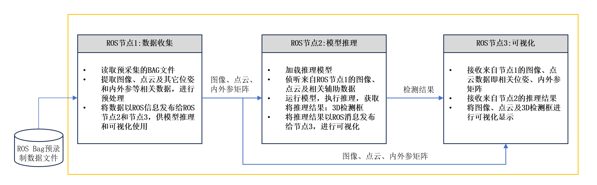
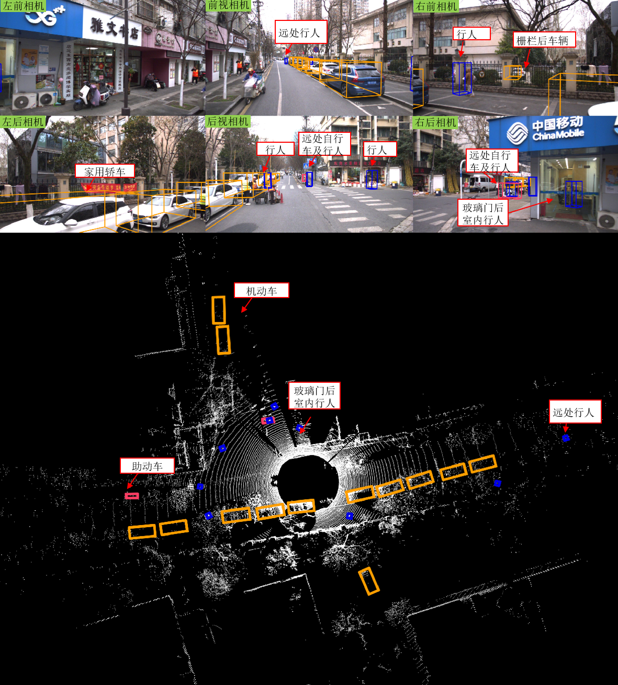
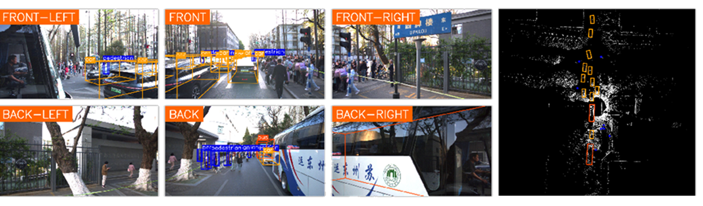
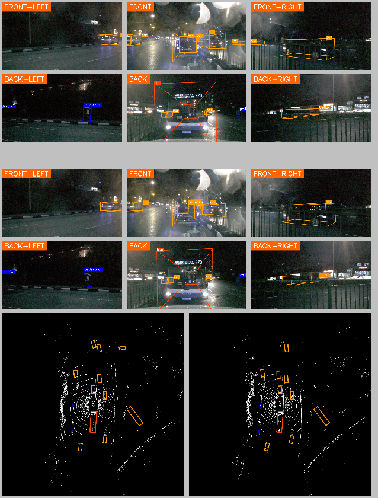

# BEVFusion Enhancement & Visualization

This repository is built on top of the **BEVFusion baseline** and provides enhanced tools for **visualizing perception and detection results**.

It supports:
- **Single-model visualization** — for either the BEVFusion baseline or an enhanced model
- **Two-model comparison** — side-by-side visualization of outputs from two different models

---

## Input Data

The input to the visualization pipeline is a **recorded ROS bag file**.  
The overall processing and visualization structure is illustrated in the diagram below:



---

## Code Structure

All visualization-related logic is located in:

```text
tools/my_tools/
```

## Visualization Configuration
Visualization behavior and layout are configurable through:
```text
infer_cfg.yaml
```
---
## Visualization Examples

### Single-Model Visualization
Below are two examples demonstrating different layout configurations for single-model visualization:




### Two-Model Comparison Visualization

For two-model comparison, the visualization layout is shown in the following example:


---

## Setup and Usage

For detailed environment setup, dependency installation, and inference usage,
please refer to the original BEVFusion repository.
